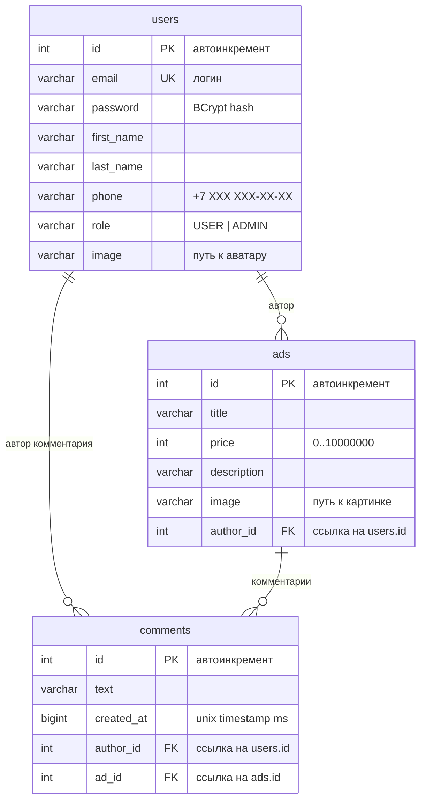
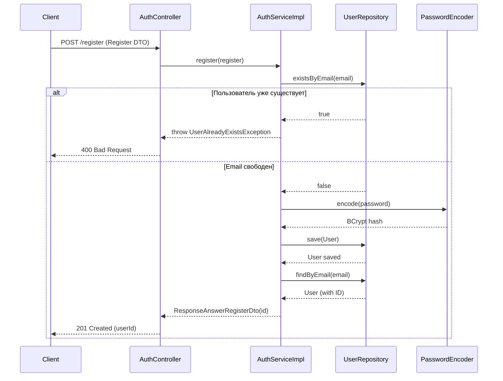
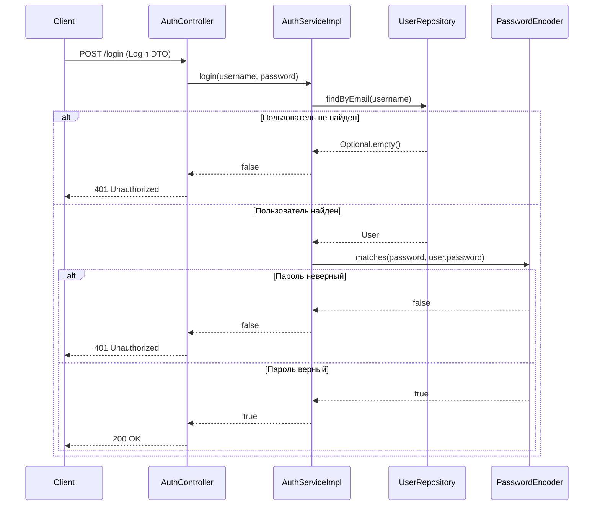
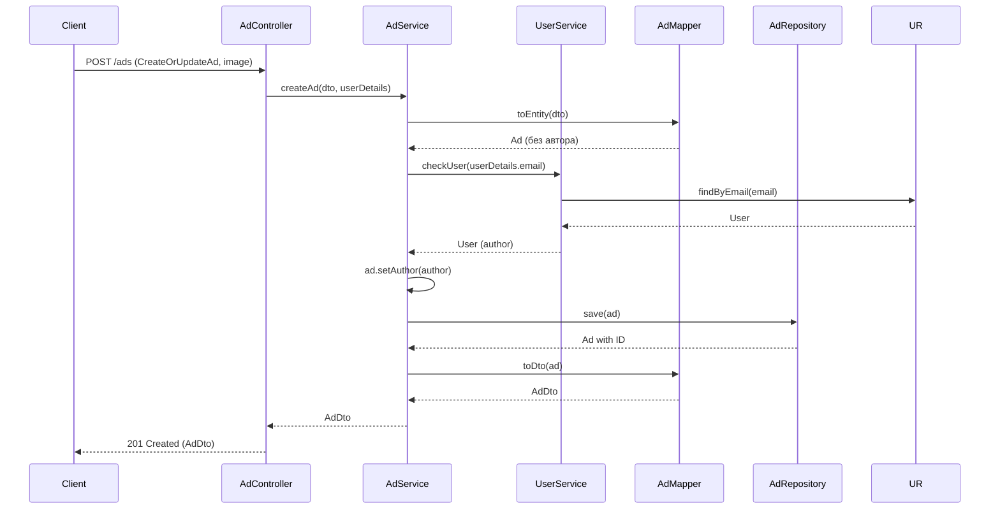
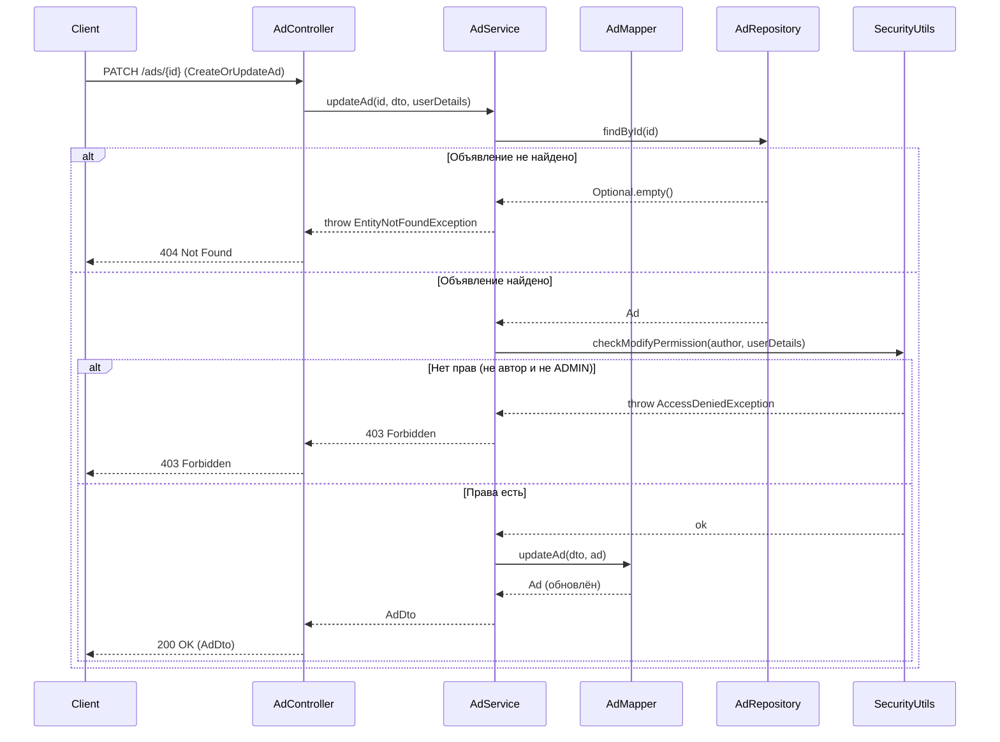
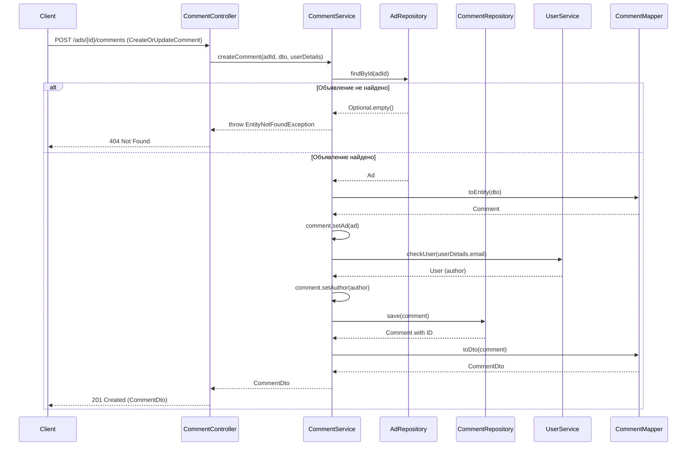
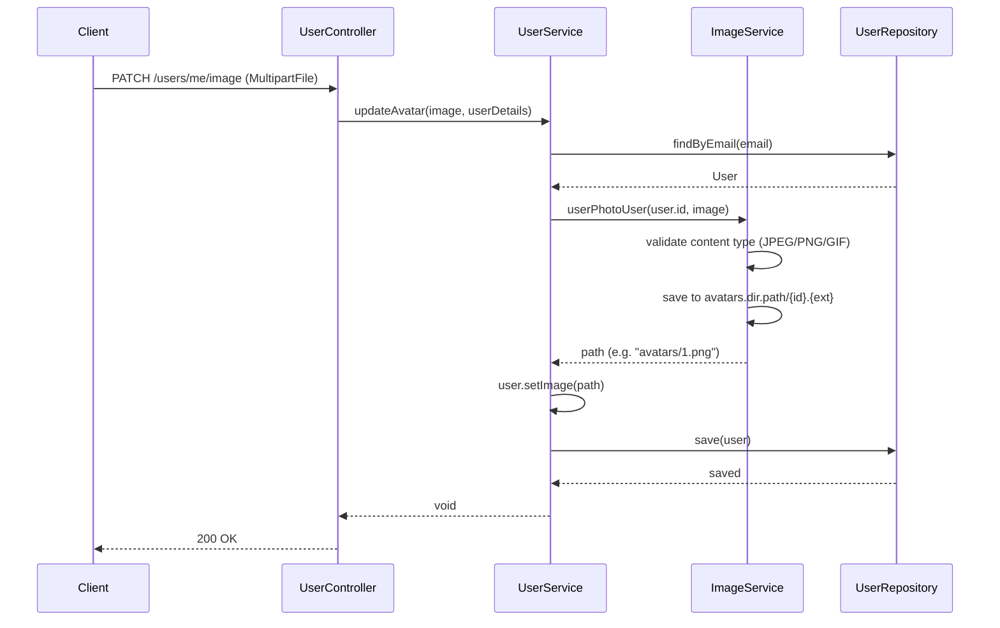
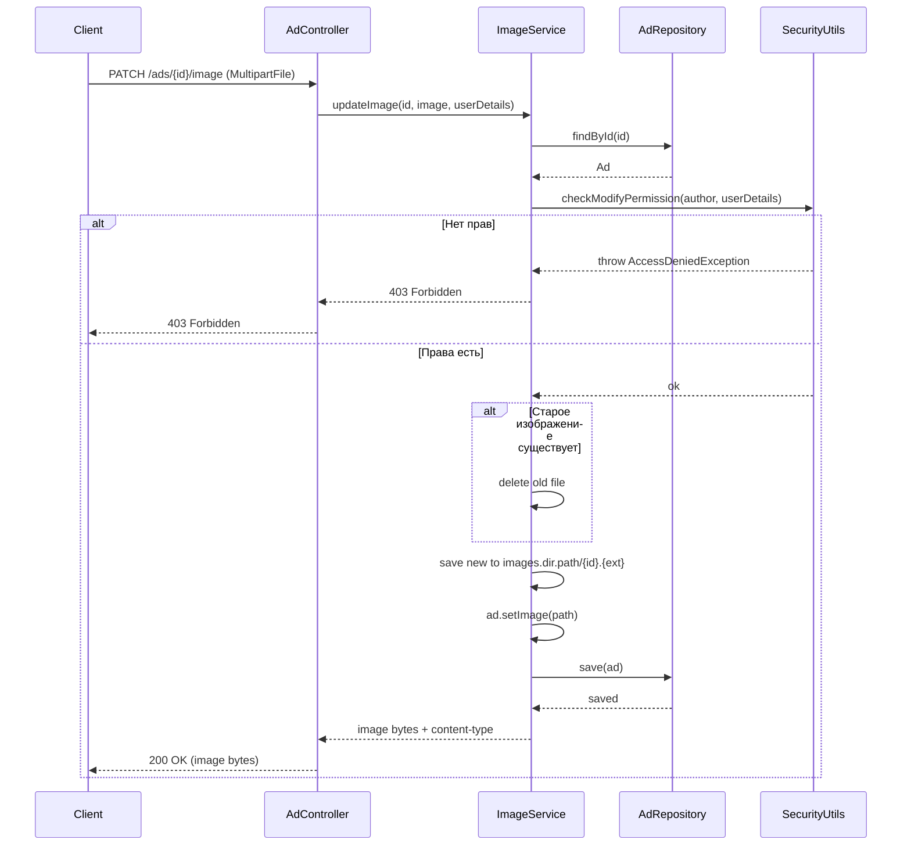

# Ads Application — Платформа объявлений

Веб-приложение для размещения и управления объявлениями с возможностью комментирования. Разработано на Spring Boot 3.

## Функциональность

- Регистрация и аутентификация пользователей (Basic Auth)
- Управление объявлениями: создание, редактирование, удаление, просмотр
- Комментирование объявлений
- Загрузка и обновление изображений объявлений (JPEG/PNG/GIF) и аватаров пользователей
- Ролевая модель: USER (обычный пользователь) и ADMIN (полный доступ)
- Swagger UI с настройкой HTTP Basic Auth

## Стек технологий

| Компонент               | Технология                                    |
|-------------------------|-----------------------------------------------|
| Язык                    | Java 17                                       |
| Фреймворк               | Spring Boot 3.5, Spring MVC, Spring Security  |
| База данных             | PostgreSQL 15                                 |
| ORM                     | Spring Data JPA, Hibernate                    |
| Миграции БД             | Liquibase                                     |
| Маппинг DTO             | MapStruct                                     |
| Документация API        | OpenAPI / Swagger UI (SpringDoc)              |
| Контейнеризация         | Docker, Docker Compose                        |
| Сборка                  | Maven                                         |

## Запуск

### Требования

- Java 17+
- Docker и Docker Compose (для БД PostgreSQL)
- Maven (или `./mvnw`)

### 1. Запуск БД

```bash
docker compose up -d
```

PostgreSQL будет доступен на порту `5433`.

### 2. Сборка и запуск

```bash
./mvnw spring-boot:run
```

Приложение запустится на `http://localhost:8080`.

### 3. Swagger UI

После запуска документация API доступна по адресу:

```
http://localhost:8080/swagger-ui.html
```

## API Endpoints

### Авторизация

| Метод   | URL            | Описание             |
|---------|----------------|----------------------|
| POST    | `/login`       | Вход в систему       |
| POST    | `/register`    | Регистрация          |

### Пользователи

| Метод  | URL                  | Описание                  |
|--------|----------------------|---------------------------|
| GET    | `/users/me`          | Информация о себе         |
| PATCH  | `/users/me`          | Обновить профиль          |
| POST   | `/users/set_password`| Сменить пароль            |
| PATCH  | `/users/me/image`    | Обновить аватар (multipart/form-data, JPEG/PNG/GIF) |

### Объявления

| Метод  | URL              | Описание                              |
|--------|------------------|---------------------------------------|
| GET    | `/ads`           | Все объявления                        |
| GET    | `/ads/me`        | Мои объявления                        |
| GET    | `/ads/{id}`      | Детали объявления                     |
| POST   | `/ads`           | Создать объявление (multipart, опционально image) |
| PATCH  | `/ads/{id}`      | Обновить объявление                   |
| DELETE | `/ads/{id}`      | Удалить объявление                    |
| PATCH  | `/ads/{id}/image`| Обновить изображение (multipart, JPEG/PNG/GIF) |

### Комментарии

| Метод  | URL                           | Описание               |
|--------|-------------------------------|------------------------|
| GET    | `/ads/{id}/comments`          | Комментарии объявления |
| POST   | `/ads/{id}/comments`          | Добавить комментарий   |
| PATCH  | `/ads/{adId}/comments/{id}`   | Обновить комментарий   |
| DELETE | `/ads/{adId}/comments/{id}`   | Удалить комментарий    |

## Конфигурация путей для файлов

В `application.properties` задаются директории для хранения:

```properties
images.dir.path=images      # директория для картинок объявлений
avatars.dir.path=avatars    # директория для аватаров пользователей
```

По умолчанию файлы сохраняются в папки `images/` и `avatars/` в рабочей директории приложения.
Имена файлов формируются как `{id}.{расширение}` (например, `1.png`).

## Структура проекта

```
src/
├── main/java/ru/skypro/homework/
│   ├── config/          # Конфигурация Spring Security
│   ├── controller/      # REST-контроллеры
│   ├── dto/             # DTO для запросов и ответов
│   ├── exception/       # Исключения и глобальный обработчик
│   ├── filter/          # CORS-фильтр
│   ├── mapper/          # MapStruct-мапперы
│   ├── model/           # JPA-сущности
│   ├── repository/      # Spring Data JPA репозитории
│   ├── service/         # Бизнес-логика
│   └── util/            # Утилиты (SecurityUtils)
└── main/resources/
    ├── application.properties
    └── liquibase/        # Миграции БД
```

## Тестирование

```bash
./mvnw test
```

Для тестов используется H2 in-memory БД.

## Схема базы данных



## Диаграммы последовательности

### Регистрация нового пользователя



### Вход в систему



### Создание объявления



### Обновление объявления (с проверкой прав)



### Добавление комментария к объявлению



### Обновление аватара пользователя



### Обновление изображения объявления



## Лицензия

Учебный проект в рамках курса Java-разработчик.
